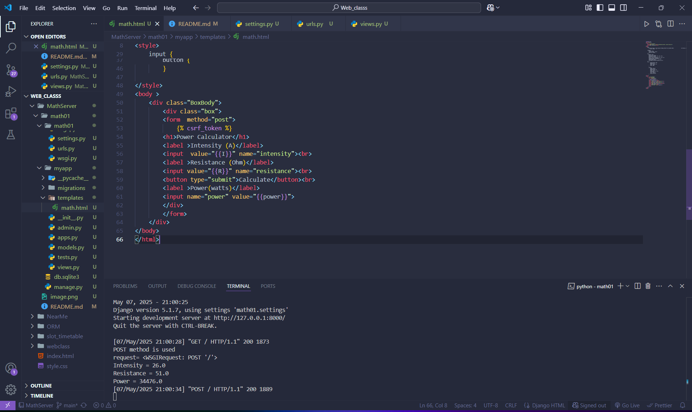
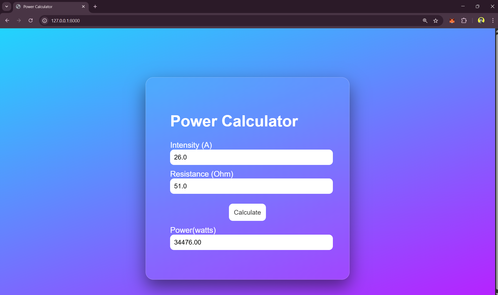

# Ex.05 Design a Website for Server Side Processing

## Date:7/5/2025

## AIM:
 To design a website to calculate the power of a lamp filament in an incandescent bulb in the server side. 

## FORMULA:
P = I2R
  P --> Power (in watts)
  I --> Intensity
  R --> Resistance

## DESIGN STEPS:

### Step 1:
Clone the repository from GitHub.

### Step 2:
Create Django Admin project.

### Step 3:
Create a New App under the Django Admin project.

### Step 4:
Create python programs for views and urls to perform server side processing.

### Step 5:
Create a HTML file to implement form based input and output.

### Step 6:
Publish the website in the given URL.

## PROGRAM :
~~~py
math.html
<!DOCTYPE html>
<html lang="en">
<head>
    <meta charset="UTF-8">
    <meta name="viewport" content="width=device-width, initial-scale=1.0">
    <title>Power Calculator</title>
</head>

<body >
    

        

        <form  method="post">
            
        <h1>Power Calculator</h1>
        <label >Intensity (A)</label>
        <input  value="{{I}}" name="intensity"> 
        <label >Resistance (Ohm)</label>
        <input value="{{R}}" name="resistance"> 
        <button type="submit">Calculate</button> 
        <label >Power(watts)</label>
        <input name="power" value="{{power}}">
        

        </form>
    

</body>
</html>

views.py

from django.shortcuts import render
def lamp_power(request):
    context = {}
    context['power'] = ""
    context['I'] = ""
    context['R'] = ""  

    if request.method == 'POST':

        I = float(request.POST.get('intensity', '0')) 

        R = float(request.POST.get('resistance', '0')) 
        
        power = (I*I)*R
       
        context['power'] = f"{ power:.2f}"
        
        context['I'] = I
        
        context['R'] = R
        
        print(f"POST method is used")
        print(f"request= {request}")
        print(f"Intensity = {I}")
        print(f"Resistance = {R}")
        print(f"Power = {power}")
    
    return render(request, 'math.html',context)

urls.py

from django.contrib import admin
from django.urls import path
from myapp import views

urlpatterns = [
    path('admin/', admin.site.urls),
    path('lamp-power/', views.lamp_power, name="lamp_power"),
    path('', views.lamp_power, name="lamp_power_root")
]
~~~

## SERVER SIDE PROCESSING:

## HOMEPAGE:

## RESULT:
The program for performing server side processing is completed successfully.
